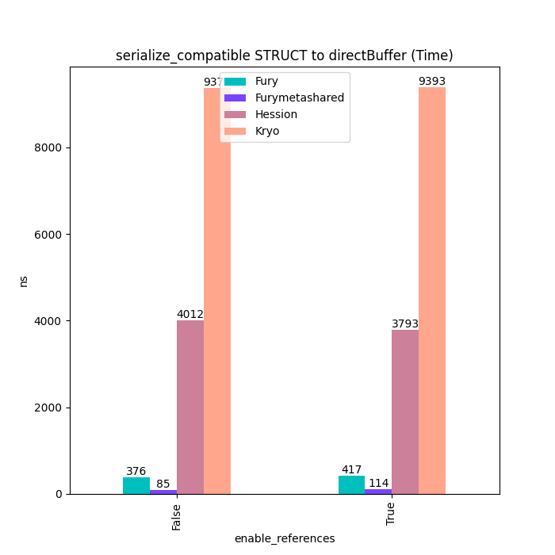
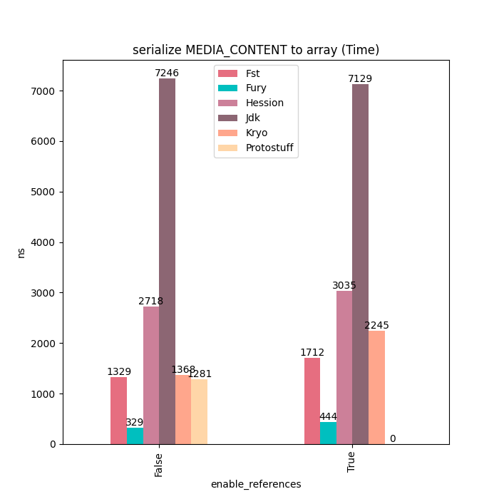
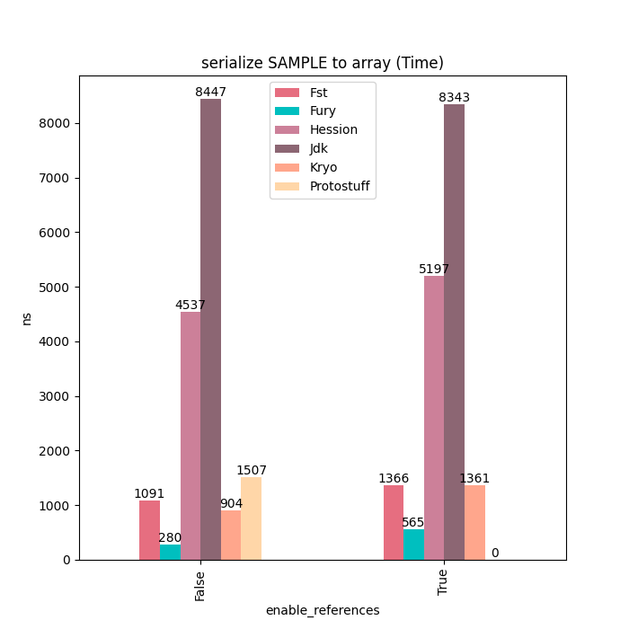

<div align="center">
  <br>
</div>

# Fury: Blazing Fast Binary Serialization

Fury is a blazing fast multi-language serialization framework powered by jit(just-in-time compilation) and zero-copy:

- Support Java/Python/C++/Golang/Javascript.
- Design and implement multiple binary protocols:
  - Cross-language object graph protocol:
    - Cross-language serialize any object automatically, no need for IDL definition, schema compilation and object protocol
      conversion.
    - Support shared reference and circular reference, no duplicate data or recursion error.
  - Native-language object graph protocol
  - Row format protocol: a cache-friendly binary random access row format, supports skipping serialization and partial serialization,
    and can convert to column-format automatically
- Zero-copy support: cross-language out-of-band serialization protocol inspired
  by [pickle5](https://peps.python.org/pep-0574/) and off-heap read/write.
- High performance: A highly-extensible JIT framework to generate serializer code at runtime in an async multi-thread way to speed serialization, providing 20-200x performance speed up:
    - reduce memory access by inline variable in generated code.
    - reduce virtual method invocation by inline call in generated code.
    - reduce conditional branching.
    - reduce hash lookup.

In addition to cross-language serialization, Fury also features at:

- Drop-in replaces Java serialization frameworks such as JDK/Kryo/Hessian without modifying any code, but 100x faster. 
  It can greatly improve the efficiency of high-performance RPC calls, data transfer and object persistence.
- JDK serialization 100% compatible, support java custom serialization 
  `writeObject/readObject/writeReplace/readResolve/readObjectNoData` natively in fury.
- Supports shared and circular reference object serialization for golang.
- Supports automatic object serialization for golang.


https://furyio.org

## Benchmarks
Different serialization frameworks has different purposes, the benchmark results here are just for reference.

If you benchmark it for your case manually, please ensure all serialization framework are configured for same purpose. Dynamic serialization frameworks need to support polymorphism and reference, 
which has more cost compared to static serialization, unless it uses the jit techniques as fury did.

Since fury will generate code in runtime, please warm up it before collecting benchmark statistics.

### Java Serialization






See [benchmarks](https://github.com/alipay/fury/tree/main/docs/benchmarks) for more benchmarks about type forward/backward compatibility, off-heap support, zero-copy serialization.

## Installation
### Java
Nightly snapshot:
```xml
<repositories>
  <repository>
    <id>sonatype</id>
    <url>https://oss.sonatype.org/content/repositories/snapshots/</url>
    <releases>
      <enabled>false</enabled>
    </releases>
    <snapshots>
      <enabled>true</enabled>
    </snapshots>
  </repository>
</repositories>
<dependency>
  <groupId>org.furyio</groupId>
  <artifactId>fury-core</artifactId>
  <version>0.1.0-SNAPSHOT</version>
</dependency>
<!-- row/arrow format support -->
<!-- <dependency>
  <groupId>org.furyio</groupId>
  <artifactId>fury-format</artifactId>
  <version>0.1.0-SNAPSHOT</version>
</dependency> -->
```
Release version: coming soon.

### Python
```bash
# Python whl will be released soon. 
# Currently you need to install from the source.
git clone https://github.com/alipay/fury.git
cd fury/python
pip install -v -e .
```
### JavaScript
```bash
npm install @furyjs/fury
```
### Golang
Coming soon.

## Quickstart

Fury supports multiple serialization protocols, the usage may have minor difference:
- Java serialization protocol
- Cross-language object graph protocol
- Row format protocol

If you don't have cross-language requirements, using `Java serialization protocol` will 
have better performance.

Here we give a quict start about how to use fury API, for detailed guide, see xxx for more detailed guide.

## Compatibility
### Schema Compatibility

### Binary Compatibility

### API Compatibility

## Security


## RoadMap
- Meta compression, auto meta sharing and cross-language schema compatibility.
- AOT Framework for c++/golang/rust to generate code statically.
- C++/Rust object graph serialization support
- Golang/Rust/NodeJS row format support
- ProtoBuffer compatibility support
- Protocols for features and knowledge graph serialization
- Continuously improve our serialization infrastructure for any new protocols

## How to Contribute
Please read our [project development guide](https://github.com/alipay/fury/blob/main/docs/development.md).

## Getting involved

| Platform                                                                                                                                                          | Purpose                                                                                                                                                                                                   | Estimated Response Time |
|-------------------------------------------------------------------------------------------------------------------------------------------------------------------|-----------------------------------------------------------------------------------------------------------------------------------------------------------------------------------------------------------|-------------------------|
| [GitHub Issues](https://github.com/alipay/fury/issues)                                                                                                            | For reporting bugs and filing feature requests.                                                                                                                                                           | < 1 days                |
| [Slack](https://join.slack.com/t/fury-project/shared_invite/zt-1u8soj4qc-ieYEu7ciHOqA2mo47llS8A)                                                                  | For collaborating with other Fury users and latest announcements about Fury.                                                                                                                              | < 2 days                |
| [StackOverflow](https://stackoverflow.com/questions/tagged/fury)                                                                                                  | For asking questions about how to use Fury.                                                                                                                                                               | < 2 days                |
| [Zhihu](https://www.zhihu.com/column/c_1638859452651765760)  [Twitter](https://twitter.com/fury_community)  [Youtube](https://www.youtube.com/@FurySerialization) | Follow us for latest announcements about Fury.                                                                                                                                                            | < 2 days                |
| WeChat Official Account(微信公众号) / Dingding Group(钉钉群)                                                                                                              | <div style="text-align:center;">  </div> | < 2 days                |
