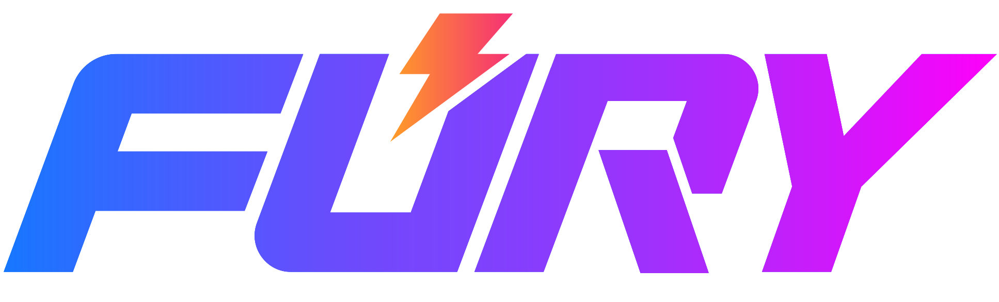
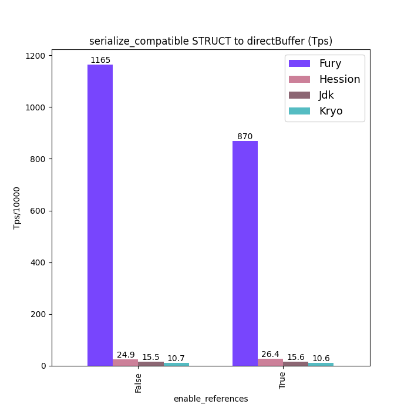
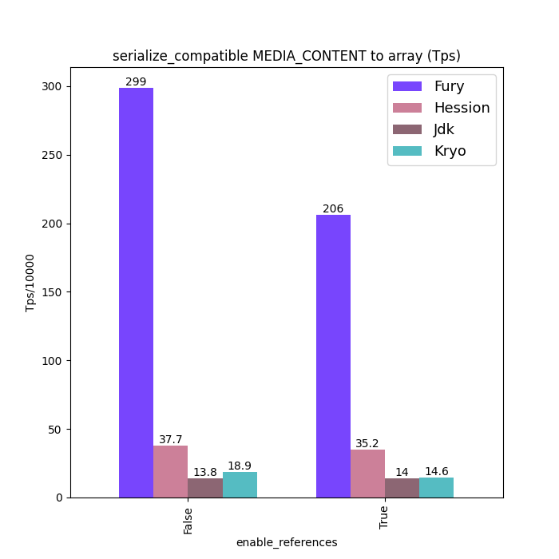
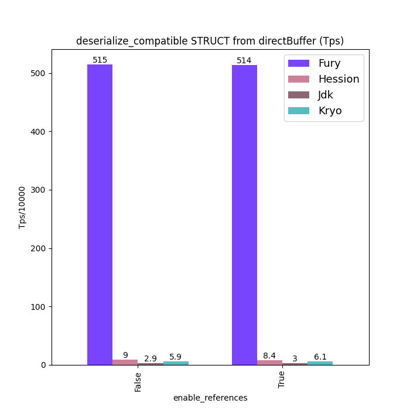
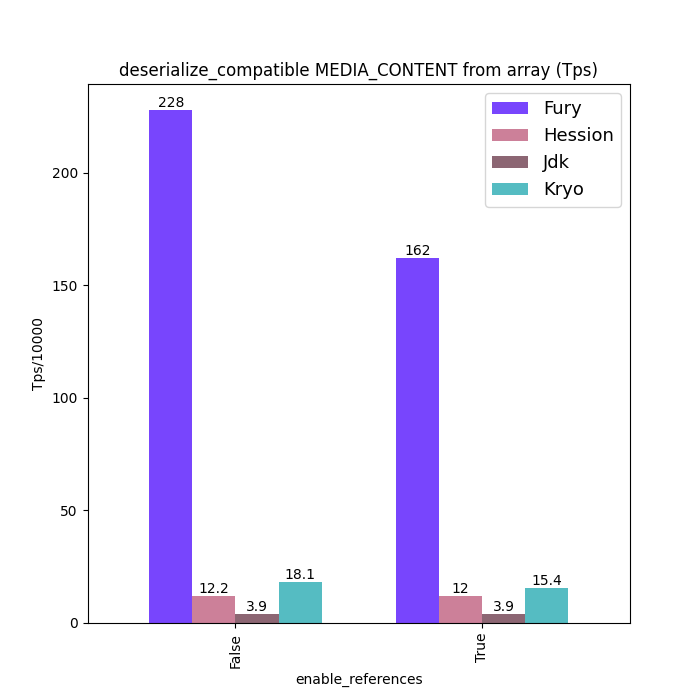

<div align="center">
  <br>
</div>

[](https://github.com/apache/incubator-fury/actions/workflows/ci.yml)
[](https://join.slack.com/t/fury-project/shared_invite/zt-1u8soj4qc-ieYEu7ciHOqA2mo47llS8A)
[](https://twitter.com/ApacheFury)
[](https://search.maven.org/#search|gav|1|g:"org.furyio"%20AND%20a:"fury-core")


**Apache Fury (incubating)** is a blazingly-fast multi-language serialization framework powered by **JIT** (just-in-time compilation) and **zero-copy**, providing up to 170x performance and ultimate ease of use.

https://fury.apache.org

## Features
- **Multiple languages**: Java/Python/C++/Golang/JavaScript/Rust/Scala/TypeScript.
- **Zero-copy**: Cross-language out-of-band serialization inspired
  by [pickle5](https://peps.python.org/pep-0574/) and off-heap read/write.
- **High performance**: A highly-extensible JIT framework to generate serializer code at runtime in an async multi-thread way to speed serialization, providing 20-170x speed up by:
    - reduce memory access by inlining variables in generated code.
    - reduce virtual method invocation by inline call in generated code.
    - reduce conditional branching.
    - reduce hash lookup.
- **Multiple binary protocols**: Object graph, row format, and so on.

In addition to cross-language serialization, Fury also features at:

- Drop-in replace Java serialization frameworks such as JDK/Kryo/Hessian, but 100x faster at most, which can greatly improve
 the efficiency of high-performance RPC calls, data transfer, and object persistence.
- **100% compatible** with JDK serialization API with much faster implementation: supporting JDK `writeObject`/`readObject`/`writeReplace`/`readResolve`/`readObjectNoData`/`Externalizable` API.
- Supports **Java 8~21**, Java 17+ `record` is supported too.
- Supports [AOT compilation serialization](docs/guide/graalvm_guide.md) for **GraalVM native image**, and no reflection/serialization json config are needed.
- Supports shared and circular reference object serialization for golang.
- Supports [scala serialization](docs/guide/scala_guide.md)
- Supports automatic object serialization for golang.

## Protocols
Fury designed and implemented multiple binary protocols for different scenarios:
- **[xlang serialization format](docs/specification/xlang_serialization_spec.md)**:
  - Cross-language serialize any object automatically, no need for IDL definition, schema compilation and object to/from
    protocol conversion.
  - Support optional shared reference and circular reference, no duplicate data or recursion error.
  - Support object polymorphism.
- **[Java serialization format](docs/specification/java_serialization_spec.md)**: Highly-optimized and drop-in replacement for Java serialization.
- **[Row format format](docs/specification/row_format_spec.md)**: A cache-friendly binary random access format, supports skipping serialization and
  partial serialization, and can convert to column-format automatically.

New protocols can be easily added based on Fury existing buffer, encoding, meta, codegen and other capabilities. All of those share the same codebase, and the optimization for one protocol can be reused by another protocol.

## Benchmarks
Different serialization frameworks are suitable for different scenarios, and benchmark results here are for reference only.

If you need to benchmark for your specific scenario, make sure all serialization frameworks are appropriately configured for that scenario.

Dynamic serialization frameworks support polymorphism and references, but they often come with a higher cost compared to static serialization frameworks, unless they utilize JIT techniques like Fury does.
To ensure accurate benchmark statistics, it is advisable to **warm up** the system before collecting data due to Fury's runtime code generation.

### Java Serialization
In these charts below, titles containing "compatible" represent schema compatible mode: type forward/backward compatibility is enabled; while titles without "compatible" represent schema consistent mode: class schema must be the same between serialization and deserialization.

Where `Struct` is a class with [100 primitive fields](https://github.com/apache/incubator-fury/tree/main/docs/benchmarks#Struct), `MediaContent` is a class from [jvm-serializers](https://github.com/eishay/jvm-serializers/blob/master/tpc/src/data/media/MediaContent.java), and `Sample` is a class from [kryo benchmark](https://github.com/EsotericSoftware/kryo/blob/master/benchmarks/src/main/java/com/esotericsoftware/kryo/benchmarks/data/Sample.java).

<p align="center">




</p>

<p align="center">




</p>

See [benchmarks](https://github.com/apache/incubator-fury/tree/main/docs/benchmarks) for more benchmarks about type forward/backward compatibility, off-heap support, zero-copy serialization.

## Installation
### Java
Nightly snapshot:

```xml
<repositories>
  <repository>
    <id>apache</id>
    <url>https://repository.apache.org/snapshots/</url>
    <releases>
      <enabled>false</enabled>
    </releases>
    <snapshots>
      <enabled>true</enabled>
    </snapshots>
  </repository>
</repositories>
<dependency>
  <groupId>org.apache.fury</groupId>
  <artifactId>fury-core</artifactId>
  <version>0.5.0-SNAPSHOT</version>
</dependency>
<!-- row/arrow format support -->
<!-- <dependency>
  <groupId>org.apache.fury</groupId>
  <artifactId>fury-format</artifactId>
  <version>0.5.0-SNAPSHOT</version>
</dependency> -->
```

Release version:
```xml
<dependency>
  <groupId>org.furyio</groupId>
  <artifactId>fury-core</artifactId>
  <version>0.4.1</version>
</dependency>
<!-- row/arrow format support -->
<!-- <dependency>
  <groupId>org.furyio</groupId>
  <artifactId>fury-format</artifactId>
  <version>0.4.1</version>
</dependency> -->
```

Maven groupId will be changed to `org.apache.fury` when next version is released.

### Scala
```sbt
libraryDependencies += "org.furyio" % "fury-core" % "0.4.1"
```

### Python
```bash
pip install pyfury
```

### JavaScript
```bash
npm install @furyjs/fury
```

### Golang
```bash
go get github.com/apache/incubator-fury/go/fury
```

## Quickstart
Here we give a quick start about how to use Fury, see [user guide](docs/README.md) for more details about [java](docs/guide/java_serialization_guide.md), [cross language](docs/guide/xlang_serialization_guide.md), and [row format](docs/guide/row_format_guide.md).

### Fury java object graph serialization
If you don't have cross-language requirements, using this mode will
result in better performance.
```java
import org.apache.fury.*;
import org.apache.fury.config.*;
import java.util.*;

public class Example {
  public static void main(String[] args) {
    SomeClass object = new SomeClass();
    // Note that Fury instances should be reused between
    // multiple serializations of different objects.
    {
      Fury fury = Fury.builder().withLanguage(Language.JAVA)
        // Allow to deserialize objects unknown types, more flexible
        // but may be insecure if the classes contains malicious code.
        .requireClassRegistration(true)
        .build();
      // Registering types can reduce class name serialization overhead, but not mandatory.
      // If class registration enabled, all custom types must be registered.
      fury.register(SomeClass.class);
      byte[] bytes = fury.serialize(object);
      System.out.println(fury.deserialize(bytes));
    }
    {
      ThreadSafeFury fury = Fury.builder().withLanguage(Language.JAVA)
        // Allow to deserialize objects unknown types, more flexible
        // but may be insecure if the classes contains malicious code.
        .requireClassRegistration(true)
        .buildThreadSafeFury();
      byte[] bytes = fury.serialize(object);
      System.out.println(fury.deserialize(bytes));
    }
    {
      ThreadSafeFury fury = new ThreadLocalFury(classLoader -> {
        Fury f = Fury.builder().withLanguage(Language.JAVA)
          .withClassLoader(classLoader).build();
        f.register(SomeClass.class);
        return f;
      });
      byte[] bytes = fury.serialize(object);
      System.out.println(fury.deserialize(bytes));
    }
  }
}
```

### Cross-language object graph serialization
**Java**
```java
import org.apache.fury.*;
import org.apache.fury.config.*;
import java.util.*;

public class ReferenceExample {
  public static class SomeClass {
    SomeClass f1;
    Map<String, String> f2;
    Map<String, String> f3;
  }

  public static Object createObject() {
    SomeClass obj = new SomeClass();
    obj.f1 = obj;
    obj.f2 = ofHashMap("k1", "v1", "k2", "v2");
    obj.f3 = obj.f2;
    return obj;
  }

  // mvn exec:java -Dexec.mainClass="org.apache.fury.examples.ReferenceExample"
  public static void main(String[] args) {
    Fury fury = Fury.builder().withLanguage(Language.XLANG)
      .withRefTracking(true).build();
    fury.register(SomeClass.class, "example.SomeClass");
    byte[] bytes = fury.serialize(createObject());
    // bytes can be data serialized by other languages.
    System.out.println(fury.deserialize(bytes));
  }
}
```

**Python**

```python
from typing import Dict
import pyfury

class SomeClass:
    f1: "SomeClass"
    f2: Dict[str, str]
    f3: Dict[str, str]

fury = pyfury.Fury(ref_tracking=True)
fury.register_class(SomeClass, type_tag="example.SomeClass")
obj = SomeClass()
obj.f2 = {"k1": "v1", "k2": "v2"}
obj.f1, obj.f3 = obj, obj.f2
data = fury.serialize(obj)
# bytes can be data serialized by other languages.
print(fury.deserialize(data))
```

**Golang**

```go
package main

import furygo "github.com/apache/incubator-fury/go/fury"
import "fmt"

func main() {
	type SomeClass struct {
		F1 *SomeClass
		F2 map[string]string
		F3 map[string]string
	}
	fury := furygo.NewFury(true)
	if err := fury.RegisterTagType("example.SomeClass", SomeClass{}); err != nil {
		panic(err)
	}
	value := &SomeClass{F2: map[string]string{"k1": "v1", "k2": "v2"}}
	value.F3 = value.F2
	value.F1 = value
	bytes, err := fury.Marshal(value)
	if err != nil {
	}
	var newValue interface{}
	// bytes can be data serialized by other languages.
	if err := fury.Unmarshal(bytes, &newValue); err != nil {
		panic(err)
	}
	fmt.Println(newValue)
}
```

### Row format
#### Java
```java
public class Bar {
  String f1;
  List<Long> f2;
}

public class Foo {
  int f1;
  List<Integer> f2;
  Map<String, Integer> f3;
  List<Bar> f4;
}

RowEncoder<Foo> encoder = Encoders.bean(Foo.class);
Foo foo = new Foo();
foo.f1 = 10;
foo.f2 = IntStream.range(0, 1000000).boxed().collect(Collectors.toList());
foo.f3 = IntStream.range(0, 1000000).boxed().collect(Collectors.toMap(i -> "k"+i, i->i));
List<Bar> bars = new ArrayList<>(1000000);
for (int i = 0; i < 1000000; i++) {
  Bar bar = new Bar();
  bar.f1 = "s"+i;
  bar.f2 = LongStream.range(0, 10).boxed().collect(Collectors.toList());
  bars.add(bar);
}
foo.f4 = bars;
// Can be zero-copy read by python
BinaryRow binaryRow = encoder.toRow(foo);
// can be data from python
Foo newFoo = encoder.fromRow(binaryRow);
// zero-copy read List<Integer> f2
BinaryArray binaryArray2 = binaryRow.getArray(1);
// zero-copy read List<Bar> f4
BinaryArray binaryArray4 = binaryRow.getArray(3);
// zero-copy read 11th element of `readList<Bar> f4`
BinaryRow barStruct = binaryArray4.getStruct(10);

// zero-copy read 6th of f2 of 11th element of `readList<Bar> f4`
barStruct.getArray(1).getLong(5);
RowEncoder<Bar> barEncoder = Encoders.bean(Bar.class);
// deserialize part of data.
Bar newBar = barEncoder.fromRow(barStruct);
Bar newBar2 = barEncoder.fromRow(binaryArray4.getStruct(20));
```
#### Python
```python
@dataclass
class Bar:
    f1: str
    f2: List[pa.int64]
@dataclass
class Foo:
    f1: pa.int32
    f2: List[pa.int32]
    f3: Dict[str, pa.int32]
    f4: List[Bar]

encoder = pyfury.encoder(Foo)
foo = Foo(f1=10, f2=list(range(1000_000)),
         f3={f"k{i}": i for i in range(1000_000)},
         f4=[Bar(f1=f"s{i}", f2=list(range(10))) for i in range(1000_000)])
binary: bytes = encoder.to_row(foo).to_bytes()
foo_row = pyfury.RowData(encoder.schema, binary)
print(foo_row.f2[100000], foo_row.f4[100000].f1, foo_row.f4[200000].f2[5])
```

## Compatibility

### Schema Compatibility
Fury java object graph serialization supports class schema forward/backward compatibility. The serialization peer and deserialization peer can add/delete fields independently.

We plan to add the schema compatibility support of cross-language serialization after [meta compression](https://github.com/apache/incubator-fury/issues/203) is finished.

### Binary Compatibility
We are still improving our protocols, thus binary compatibility is not guaranteed between Fury major releases for now.
However, it is guaranteed between minor versions. Please
`versioning` your data by Fury major version if you will upgrade Fury in the future, see [how to upgrade fury](https://github.com/apache/incubator-fury/blob/main/docs/guide/java_object_graph_guide.md#upgrade-fury) for further details.

Binary compatibility will be guaranteed when Fury 1.0 is released.

## Security
Static serialization is relatively secure. But dynamic serialization such as Fury java/python native serialization supports deserializing unregistered types, which provides more dynamics and flexibility, but also introduce security risks.

For example, the deserialization may invoke `init` constructor or `equals`/`hashCode` method, if the method body contains malicious code, the system will be at risk.

Fury provides a class registration option that is enabled by default for such protocols, allowing only deserialization of trusted registered types or built-in types.
 **Do not disable class registration unless you can ensure your environment is secure**.

If this option is disabled, you are responsible for serialization security. You can configure `org.apache.fury.resolver.ClassChecker` by
`ClassResolver#setClassChecker` to control which classes are allowed for serialization.

To report security vulnerabilities found in Fury, please follow the [ASF vulnerability reporting process](https://apache.org/security/#reporting-a-vulnerability).

## How to Build

Please read the [BUILD](docs/guide/DEVELOPMENT.md) guide for instructions on how to build.

## How to Contribute

Please read the [CONTRIBUTING](CONTRIBUTING.md) guide for instructions on how to contribute.

## License

Licensed under the [Apache License, Version 2.0](LICENSE)
