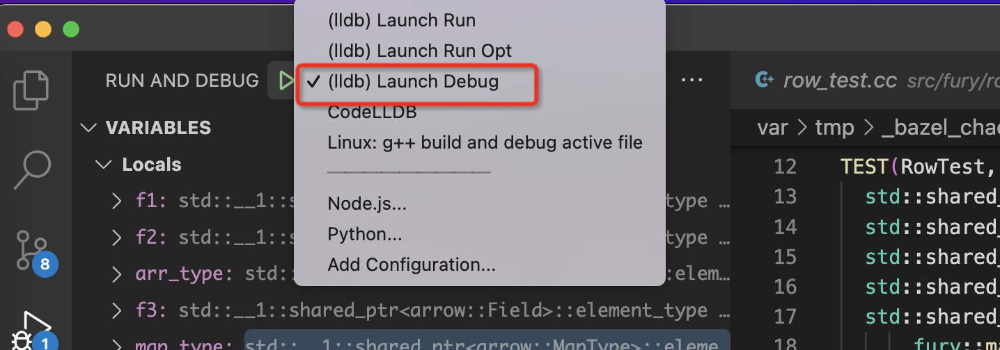

## Debugging C++

Debug C++ is tricky and binary protocol bug is hard to locate without debugging support, but setup
debugging support for bazel project is not easy.

Fury include an out-of-box `launch.json/tasks.json` config in `.vocode` directory for c++ debugging.

Just open the fury root directory in vscode, then open a test file such as `src/fury/row/row_test.cc`,
enter `F5`, then you can debug the c++ code line by line, watch variables, add breakpoints in vscode just like
java/python debugging.

## Notes

- For Macos: Install `CodeLLDB` vscode plugin
- For Linux:
  - install gdb for fedora/centos by `sudo yum install -y gdb`
  - install gdb for fedora/centos by `sudo apt-get install gdb`
- If debugging doesn't work, please select correct debug/run options:
  
- Debug will jump to source files in bazel generated directory, we need to return raw files in source tree
for debugging again: 
